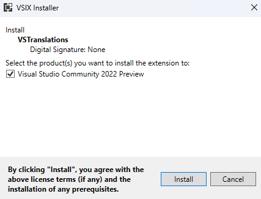

# VSTranslations

## Overview
VSTranslations is a Visual Studio extension for translating code/text written in foreign languages. Supports multiple translation engines.

## Supported Visual Studio Versions

- Visual Studio 2022 (17.x)

## Quick Start
Download the latest [VSTranslations.vsix](https://github.com/TomasStuina/VSTranslations/releases/latest/download/VSTranslations.vsix) core extension and install using VSIX installer. 

> **IMPORTANT!:** VSTranslations is only the core extension. Addtional engine plugin is required for it to properly work (e.g., Google Translate plugin): 
>
>

## Translation Plugins
- [Google Translate](https://github.com/TomasStuina/VSTranslations/releases/latest/download/VSTranslations.Plugin.GoogleTranslate.vsix)

## Usage

Configure the default translation engine to use (e.g., Google Translate):

Enable **VSTranslations** toolbar:

Select source and target languages:

Select text you want to translate:

Right-Click to open the context menu and click **Translate...**:

The translated text is displayed as a text adornment next to the corresponding line:

Selecting the translated text and clicking **Delete Translation** will remove the corresponding translation addornment:

If text is not selected then only that particular line where the cursor is placed will be translated:

## Notes:

The extension was something that was needed for my daily use, specially in a code base where the written language primarly neither was english, nor my native one. Since I just needed a simple solution to translate foreign text it is not exactly stable, thus there are many potential bugs I am (not) aware of.